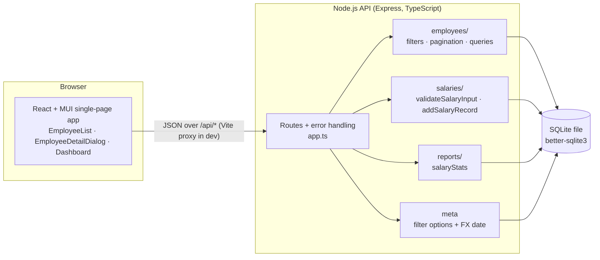
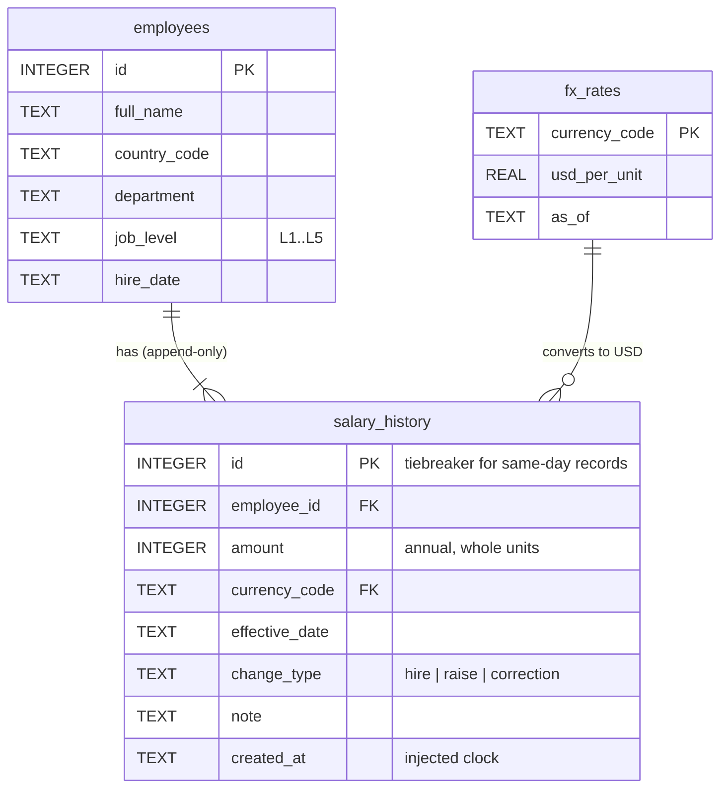
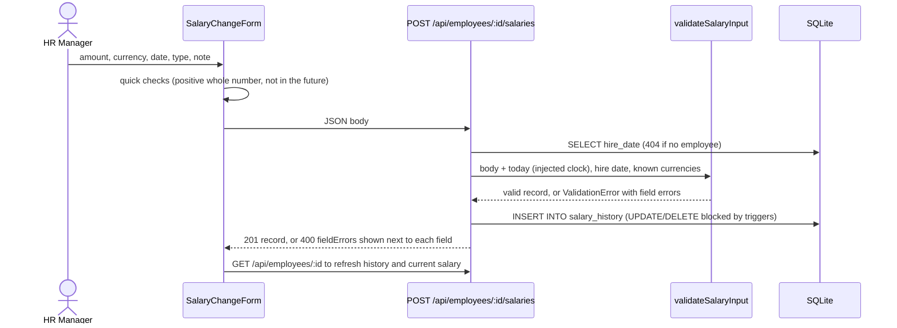

# Architecture

A single-user web app: a React single-page app talking JSON to an Express API, which reads and writes one SQLite file. At ~10,000 employees this is all the infrastructure the problem needs (see [PERFORMANCE.md](PERFORMANCE.md)).

## System overview



**Layering, and why there isn't more of it.** Routes parse HTTP input and map errors to status codes. Each feature module owns its SQL and its domain rules. There is no repository or service layer: with a handful of queries, an extra layer would mean more files to read without making anything easier to test. Every module takes the `Db` handle as a parameter, so tests pass an in-memory database directly.

## Data model



The `current_salaries` view (employee + latest salary row + USD amount) is the one definition of "current salary". The list, detail and report queries all read from it. Details are in [SCHEMA.md](SCHEMA.md).

## Key flows

### Recording a raise or correction



The server is the source of truth for validation. The client-side checks only save a round trip for the obvious cases.

### Answering a pay question ("median salary by level for Engineering in India")

`GET /api/reports/salary-stats?groupBy=jobLevel&department=Engineering&country=IN` runs one SQL statement built from these stages:

1. **filtered**: rows from `current_salaries` matching the filters (bound parameters only), with `amount_usd = amount × usd_per_unit`.
2. **ranked**: `ROW_NUMBER()` and `COUNT()` window functions give each salary its position within its group.
3. **medians**: the middle row (odd count) or the average of the two middle rows (even count).
4. **final**: `COUNT`, `AVG` and `SUM` per group, joined to the medians.

The group-by column comes from a fixed whitelist (`department`, `country`, `jobLevel`). User input is never put into the SQL text.

## Where things live

```
salary-mgmt/
├── REQUIREMENTS.md            what we're building and what's out of scope
├── README.md                  how to run and test it
├── docs/                      schema, architecture, decisions, performance, plan, AI usage
├── backend/
│   ├── migrations/            numbered .sql files, applied once each, never edited
│   ├── src/
│   │   ├── app.ts             routes and HTTP error mapping
│   │   ├── server.ts          the only place the real clock is read
│   │   ├── db.ts              connection + migration runner
│   │   ├── employees/         filters, pagination, list/detail queries
│   │   ├── salaries/          validation + append-only write path
│   │   ├── reports/           USD aggregation (avg, median, headcount, payroll)
│   │   └── seed/              deterministic 10k-employee generator
│   └── test/                  Jest + Supertest, in-memory SQLite
└── frontend/
    └── src/
        ├── api.ts             typed HTTP client (one object, easy to stub)
        ├── format.ts          currency/number formatting
        └── components/        EmployeeList, EmployeeDetailDialog, SalaryChangeForm, Dashboard
```

## Testability by design

- **Time is injected.** Business logic receives a `Clock`. Only `server.ts` reads the real one.
- **Randomness is seeded.** The seed uses a small deterministic random number generator (mulberry32) with a fixed seed.
- **The database is disposable.** Each test opens its own `:memory:` database with migrations applied, so there's no shared state and no cleanup.
- **FX rates are pinned in tests.** Refreshing the real rates never changes a test's expected numbers.
- **HTTP is stubbed in UI tests.** Components call one `api` object, which tests replace with `vi.spyOn`.
